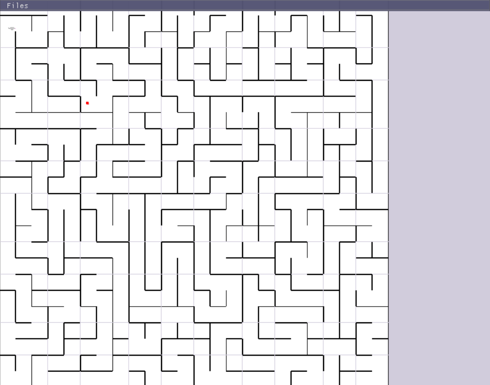

<h1><b>Labyrinth Generator SDL+CPP</b></h1>
        Labyrinth Generator is exactly what it sounds like, a perfect maze generating system that allows users to just created them randonmly with the press of a button. it is important to note that i work primarily on Windows and run a batch script for compilation on g++ for most compatibility, but everything works properly on Linux.
         </img>

<b><h2> Features </h2></b>
        <ul>
                <li> Generates perfect Mazes using the depth first search </li>
                <li> Has a character that collides on walls to solve </li>
                <li> GUI built with Dear ImGui </li>
                <li> Cross-platform support (Windows & Linux) </li>
        </ul>

<h2><b> usage </b></h2>
        <ul>
                <li> Use mouse to move camera independly </li>
                <li> WASD keys move the character around </li>
                <li> Click on generate to generate a random perfect maze </li>
                <li> The goal is always on the top right corner, every path takes you eventually to that cell </li>
        </ul>

<h2><b> </b></h2>

<b><h2>Compile</h2></b>
        As i mentioned before; I personally run my batch script including only the folders of dependencies and Headers, then it is all linked to SDL2 and ImGui which are inside of dependencies folder. Then i place all the dlls on the compilation folder. A Mafile exist that should allow you to build the application on both windows and linux

<h2>Credits</h2>
        <ul>
                <li> SDL2: The Simple DirectMedia Layer (SDL) is used for handling graphics, events, and input. SDL is licensed under the [Zlib License](https://www.libsdl.org/license.php). </li>
                <li> Dear ImGui: Dear ImGui is used for creating the GUI elements in the project. It is a bloat-free graphical user interface library primarily used for debugging tools and applications. ImGui is licensed under the [MIT License](https://github.com/ocornut/imgui/blob/master/LICENSE.txt). </li>
                <li> C++ Standard Library: The C++ Standard Library is used for many common operations like memory management, data structures, and more. </li>
        </ul>
        <h3> Developers </h3>
        <ul>
                <li> Moises Gonzalez </li>
                <li> Emmanuel Lara </li>
        </ul>
